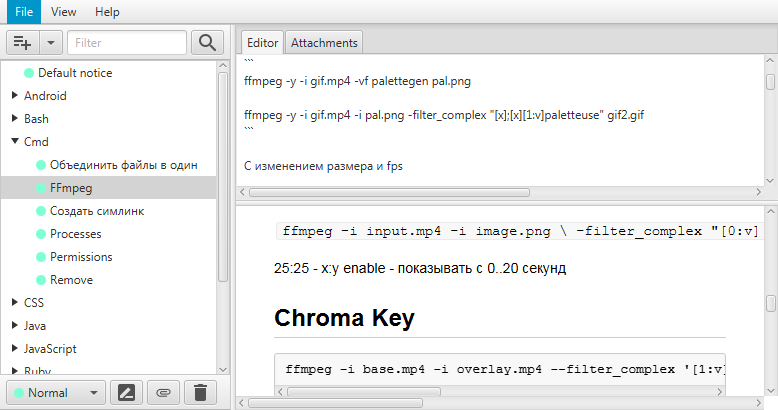
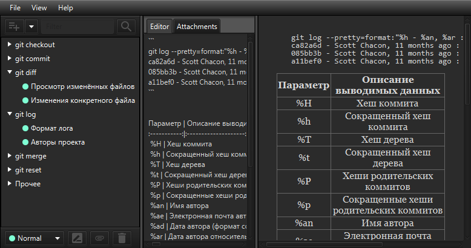

# NoticEditor

A hierarchical note editor with markdown support.

 

## Features

 - Hierarchical structure of notes
 - Markdown support
 - Syntax highlighting
 - Light and Dark themes
 - Attachments
 - Json / Zip / Password protected Zip formats
 - Export to HTML
 - Import notes/attachments from Web
 - Attachments importer plugin support


## Build

### Netbeans IDE

1. `git clone https://github.com/NoticEditorTeam/NoticEditor.git`
2. Open project in NetBeans
3. Press *Shift + F11* for clean and build. You can find jar executable in `dist/` dir.
4. For build single-jar (with libs) launch *package-single* task in build.xml.


### Gradle-based (Cross-platform)

1. `git clone https://github.com/NoticEditorTeam/NoticEditor.git`
2. `gradlew dist` — this will put jar into `./dist/`.
3. `gradlew run` — this will run the app w/o building a jar.

### Makefile (Unix)

``` bash
$ git clone https://github.com/NoticEditorTeam/NoticEditor.git
$ make
```

## License

Apache 2.0 - see [Apache 2.0 license information](LICENSE)